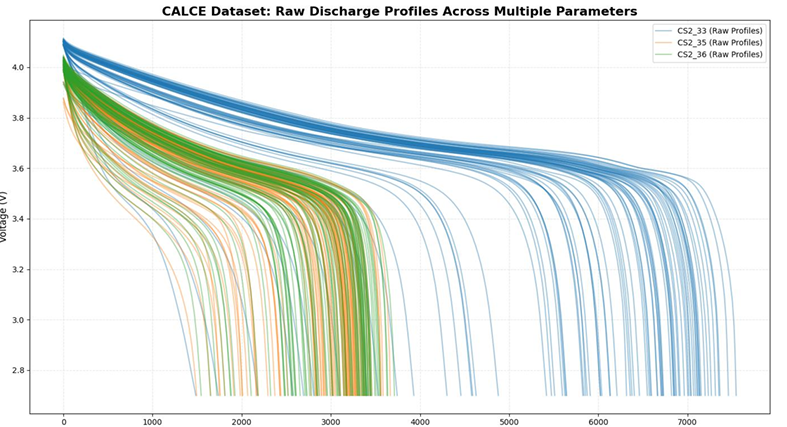

# engineering-portfolio

Graduate Aerospace Engineering student specializing in CAD-driven design, CFD analysis, and engineering system validation. Experienced in developing mechanical prototypes, conducting high-fidelity simulations, and translating theoretical models into practical engineering solutions. Passionate about applying AI/ML and data science to advance simulation-driven engineering.

Link to portfolio document: (https://tinyurl.com/ZK-eng-portfolio)

## Featured Projects

### Wing Design & Wind Tunnel Testing
Repository: https://github.com/ZaidAK786/wing-design-wind-tunnel

### EV Battery Enclosure Design
Repository: https://github.com/ZaidAK786/ev-battery-enclosure

<!--### Globe Valve CFD Simulation
Repository: https://github.com/ZaidAK786/globe-valve-cfd
-->
### Multi-Parameter Modeling of Li-Ion Battery RUL
📄 **[View Full Technical Report (In-Browser PDF)](https://<your-username>.github.io/engineering-portfolio/your-file-name.pdf)**
<a href="https://zaidak786.github.io/engineering-portfolio/Data-DrivenModelingProject.pdf" target="_blank">
  

</a>

<em>Click the preview image above to view the full PDF report in-browser.</em>

